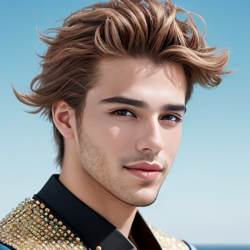
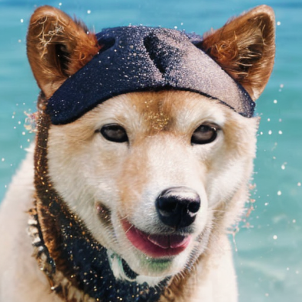
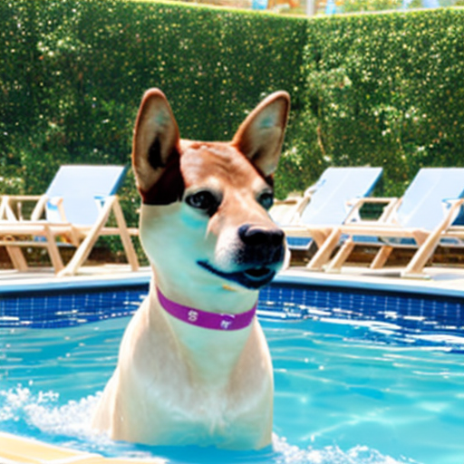

# Inpainted Privacy for Video Analytics

## 1. Environment Setup

Ensure that the environment is running on Linux. If you're using Windows, perform the following in WSL.

```
conda create -n colossaldreambooth python=3.11
conda activate colossaldreambooth
pip install -r requirements.txt
```

## 2. Run the finetuning

```
bash dreambooth.sh > finetuning_output.txt 2>&1 
```
During this stage the model will be finetuned with a new celebrity named "Tom Cruirse". The dataset used consists of 6 images of Hugh Jackman.

## 3. Review the model with inference

```
python inference.py > inference.txt 2>&1
```
Then open the output.png file to view the output image from our newly fine-tuned model.

## 4. Compare with original model

```
python inference_original.py > inference_original.txt 2>&1
```
Open the output_original.png to view the output image from the original model.

## 5. Experiment further with the new model using a new context

```
python inference_new.py > inference_new.txt 2>&1
```
Then open the output1.png file to view the output image from our newly fine-tuned model.

## 6. Review the results

Prompt: "a portrait image of a celebrity male named Tom Cruirse"

Original image: 



Dataset base images:

     

Fine-tuned model image: 



New Prompt: "Tom Cruirse playing a guitar"

Fine-tuned model image: 




